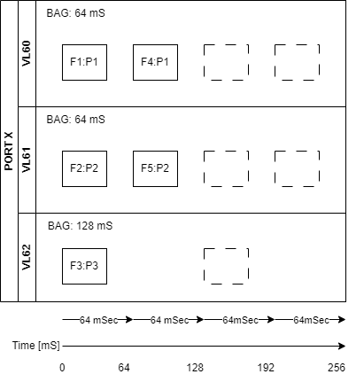

# Parameters XML File
This Custom Device can be configured using a scripting API or a Parameters XML File. This XML file defines the messages, parameters, and other settings necessary to populate a valid configuration in the System Definition. This document explains the schema used for creating a Parameters XML File, shows example sections for different encoding configurations, and outlines the defined elements and attributes.

## AIM Reference Manual

All the attributes of the different XML elements match the corresponding parameters used by the AIM driver. Refer to the **Arinc664_Reference_Manual.pdf** which is installed by the AIM BSP and available at this location: `<Program Files>\AIM GmbH\Arinc 664 Windows BSP <version, e.g. 19.6.0>\Doc` for details. Each section below will reference the corresponding AIM function call to explain each attribute in detail (e.g. range, valid values, etc.)

## Schema Location
For the full schema file, see `Parameters_XML_Schema.xsd` in the same directory as this document.

## XML Parameters File Examples (Compact)

### Example (Tx Generic Session - Basic)

```xml
<Board xmlns:xsi="http://www.w3.org/2001/XMLSchema-instance" xmlns:xsd="http://www.w3.org/2001/XMLSchema">
  <Port PortId="0">
    <TxGenericSession />
```

### Example (Tx Generic and Rx Monitor Sessions with FrameID and PayloadID)

When usign Tx Generic mode you can create complex sequences of frames that can be transmitted with very precise timing. One possible use case is the generation of frames that are associated to multiple Virtual Links that may have different transmission intervals (or BAG - Bandwidth allocation gap). Assuming the scenario below:



You can several frames that can carry a payload associated with the same set of parameters. This is why the XML file enables the use of 2 types of ID:
- **FrameID** : ID that identifies the specific frame to be sent, with its own header configuration (e.g. Packet Wait Group Time, Sequence Number, Preamble Count)
- **PayloadID** : ID that identifies the specific payload data that the frame must carry. PayloadID is uses either for Tx Generic or Tx/Rx UDP modes to identify the parameters that are associated to a specific payload

```xml
<?xml version="1.0"?>
<Board xmlns:xsi="http://www.w3.org/2001/XMLSchema-instance" xmlns:xsd="http://www.w3.org/2001/XMLSchema">
  <Port PortId="0">
    <TxGenericSession>
      <TxGenericFrame FrameID="Frame1" PayloadID="Payload1" PacketGroupWaitTime="64000">
        <Parameter>
          <direction>outgoing</direction>
          <encoding>BNR</encoding>
          <signed>true</signed>
          <startBit>0</startBit>
          <numberOfBits>64</numberOfBits>
          <scale>1</scale>
          <offset>0</offset>
          <name>Param 0</name>
          <unit>V</unit>
          <defaultValue>0</defaultValue>
        </Parameter>
      </TxGenericFrame>
      <TxGenericFrame FrameID="Frame2" PayloadID="Payload2">
        <Parameter>
          <direction>outgoing</direction>
          <encoding>BNR</encoding>
          <signed>true</signed>
          <startBit>0</startBit>
          <numberOfBits>64</numberOfBits>
          <scale>1</scale>
          <offset>0</offset>
          <name>Param 0</name>
          <unit>V</unit>
          <defaultValue>0</defaultValue>
        </Parameter>
      </TxGenericFrame>
      <TxGenericFrame FrameID="Frame3" PayloadID="Payload3">
        <Parameter>
          <direction>outgoing</direction>
          <encoding>BNR</encoding>
          <signed>true</signed>
          <startBit>0</startBit>
          <numberOfBits>64</numberOfBits>
          <scale>1</scale>
          <offset>0</offset>
          <name>Param 0</name>
          <unit>V</unit>
          <defaultValue>0</defaultValue>
        </Parameter>
      </TxGenericFrame>
      <TxGenericFrame FrameID="Frame4" PayloadID="Payload1" PacketGroupWaitTime="64000">
        <Parameter>
          <direction>outgoing</direction>
          <encoding>BNR</encoding>
          <signed>true</signed>
          <startBit>0</startBit>
          <numberOfBits>64</numberOfBits>
          <scale>1</scale>
          <offset>0</offset>
          <name>Param 0</name>
          <unit>V</unit>
          <defaultValue>0</defaultValue>
        </Parameter>
      </TxGenericFrame>
      <TxGenericFrame FrameID="Frame5" PayloadID="Payload2">
        <Parameter>
          <direction>outgoing</direction>
          <encoding>BNR</encoding>
          <signed>true</signed>
          <startBit>0</startBit>
          <numberOfBits>64</numberOfBits>
          <scale>1</scale>
          <offset>0</offset>
          <name>Param 0</name>
          <unit>V</unit>
          <defaultValue>0</defaultValue>
        </Parameter>
      </TxGenericFrame>
    </TxGenericSession>
  </Port>
</Board>
```
### Example (Tx Generic Session - CRC Error Injection)

```xml
<?xml version="1.0"?>
<Board xmlns:xsi="http://www.w3.org/2001/XMLSchema-instance" xmlns:xsd="http://www.w3.org/2001/XMLSchema" PortSpeed="FDX_1000MBIT" PortConfig="FDX_SINGLE">
  <Port PortId="0">
    <TxGenericSession>
      <TxGenericFrame FrameID="Frame1" PayloadID="Payload1" InterFrameGap="0" PacketGroupWaitTime="10000" PreambleCount="7" PhysErrorInjection="FDX_TX_FRAME_ERR_CRC" PayloadBufferMode="FDX_TX_FRAME_PBM_STD" PayloadGenerationMode="FDX_TX_FRAME_PGM_USER" NetSelect="FDX_TX_FRAME_ONLY_A" FrameStartMode="FDX_TX_FRAME_START_PGWT" />
    </TxGenericSession>
  </Port>
</Board>
```

### Example (Tx and Rx UDP sessions)

```xml
<?xml version="1.0"?>
<Board xmlns:xsi="http://www.w3.org/2001/XMLSchema-instance" xmlns:xsd="http://www.w3.org/2001/XMLSchema">
  <Port PortId="0">
    <TxUdpSession VlId="60" Bag="64" DomainID="1" SideID="1" LocationID="1" InterfaceID="1" MaxFrameLength="1518">
      <TxCommPort PayloadID="Tx1" PartitionID="1" UdpSrcPort="24" UdpDstPort="23" UdpSamplingRate="64" UdpMaxMessageSize="512">
        <Parameter>
          <direction>outgoing</direction>
          <encoding>BNR</encoding>
          <signed>true</signed>
          <startBit>0</startBit>
          <numberOfBits>64</numberOfBits>
          <scale>1</scale>
          <offset>0</offset>
          <name>Param 0</name>
          <unit>V</unit>
          <defaultValue>0</defaultValue>
        </Parameter>
      </TxCommPort>
    </TxUdpSession>
  </Port>
  <Port PortId="1">
    <RxUdpSession VlId="60" VLRange="1" Bag="0" Jitter="0" VLBufSize="32768">
      <RxCommPort PayloadID="Rx1" DomainID="1" SideID="1" LocationID="1" PartitionID="1" UdpSrcPort="24" UdpDstPort="23" UdpMaxMessageSize="512">
        <Parameter>
          <direction>outgoing</direction>
          <encoding>BNR</encoding>
          <signed>true</signed>
          <startBit>0</startBit>
          <numberOfBits>64</numberOfBits>
          <scale>1</scale>
          <offset>0</offset>
          <name>Param 0</name>
          <unit>V</unit>
          <defaultValue>0</defaultValue>
        </Parameter>
      </RxCommPort>
    </RxUdpSession>
  </Port>
</Board>
```

## Supported XML Elements
The following table describes the XML elements, or tags, you can use in a Parameters XML file. To understand more about each element (e.g. Tx Generic or Monitor) that can be configure, refer to the *Arinc664_Programmers_Guide.pdf* which is installed by the AIM BSP and available at this location: `<Program Files>\AIM GmbH\Arinc 664 Windows BSP <version, e.g. 19.6.0>\Doc`

|Element|Required?|Element Type|Min/Max Occurrences|Description|
|--- |--- |--- |--- |--- |
|`<Board>`|Yes|complex|1|Root element linke to the AIM board.|
|→`<Port>`|Yes|xs:int|1 / unbounded|Identifies one of the ports of the board.|
|→→`<TxGenericSession>`|Yes|xs:int|1|Identifies the Generic Transmit Mode assigned to the parent port.|
|→→→`<TxGenericFrame>`|Yes|xs:int|1 / unbounded|Identifies a raw frame to be transmitted by this mode and its header configuration.|
|→→→→`<parameter>`|No|complex|1/unbounded|Opening tag for a Parameter definition.|
|→→`<TxUdpSession>`|Yes|xs:int|1 / unbounded|Identifies a UDP Port-Oriented Simulation Mode assigned to the parent port.|
|→→→`<TxCommPort>`|Yes|xs:int|1 / unbounded|Identifies a Tx CommPort for the parent UDP session.|
|→→→→`<parameter>`|No|complex|1/unbounded|Opening tag for a Parameter definition.|
|→→→→→`<encoding>`|Yes|xs:string|1/1|Specifies the Encoding for the Parameter. Supported values:<br/>BNR (default) - Binary Number Representation.<br/>BCD - Binary Coded Decimal. Each decimal digit is represented by a fixed number of bits.<br/>Discrete - Set of individual adjacent bits.|
|→→→→→`<signed>`|No|xs:boolean|0/1|Specifies whether Parameter is signed. It applies only to BCD and BNR encoding. If it is a signed BCD Parameter,it is considered negative if SSM Bits are 11. For all other cases, the BCD is considered to be positive.|
|→→→→→`<startBit>`|Yes|xs:int|1/1|Specifies the Start Bit for the Parameter. It is a 0-based information. For Labels from Rx Channels, range accepted is: [0:31]. For Labels from Tx Channels, valid range is: [8:30] (Label ID (bits [0:7] and Parity Bit (bit 31) are overloaded by board firmware). For Parameters when `<encoding>` is set to BCD, `<startBit>` values supported are: 8..30.|
|→→→→→`<numberOfBits>`|Yes|xs:int|1/1|Specifies the number of bits for the Parameter. Range accepted is: [0:32].|
|→→→→→`<scale>`|No|xs:double|0/1|Specifies the Scale value to be applied to scale to and from the raw data. If no scaling is to be applied, value should be set to 1.0.|
|→→→→→`<offset>`|No|xs:double|0/1|Specifies the Offset value to be applied to offset to and from the raw data. If no offset is to be applied, value should be set to 0.0.|
|→→→→→`<name>`|Yes|xs:string|1/32|Specifies, for each Parameter, the name to be used in VeriStand. When Parameter encoding is set to Discrete, each Parameter (each bit) must have an instance of that `<name>`.|
|→→→→→`<unit>`|No|xs:string|0/1|Specifies, for each Parameter, the unit to be used in VeriStand.|
|→→→→→`<defaultValue>`|No<sup>2</sup>|xs:double|0/unbounded|Specifies, for each Parameter, the Default Value to be used for the associated VeriStand Channel. For Parameters used in Tx Channels, this XML Element must be present for each Parameter. For Parameters used in Tx Channels, when Parameter `<encoding>` is set to Discrete, each Parameter (each bit) must have an instance of that `<defaultValue>`.|
|→→→`<TxSapPort>`|Yes|xs:int|1 / unbounded|Identifies a Tx SAP Port for the parent UDP session.|
|→→`<RxUdpSession>`|Yes|xs:int|1 / unbounded|Identifies a VL-Oriented Receive Mode assigned to the parent port.|
|→→→`<RxCommPort>`|Yes|xs:int|1 / unbounded|Identifies a Tx CommPort for the parent UDP session.|
|→→→`<RxSapPort>`|Yes|xs:int|1 / unbounded|Identifies a Tx SAP Port for the parent UDP session.|
|→→`<RxMonitorSession>`|Yes|xs:int|1 |Identifies the Chronological Monitor Receive Mode assigned to the parent port.|

Notes:
1. Each element has attributes defined in the next section
2. TxCommPorts, TxSapPorts, RxCommPorts and RxSapPorts can have parameter elements as children tags 

## Supported XML Attributes for each Element

Each element has a set of attributes that match the input parameters of AIM driver functions.

|Attribute|Required?|XML Element|Type|Description|AIM Reference Function|
|--- |--- |--- |--- |--- |--- |
|BoardId|no|`<Board>`|int|Board identifier. 0 indexed - Default value: 0|none |
|PortSpeed|no|`<Board>`|enum string|Port Speed. Default: FDX_100MBIT<br>Possible values: <br>FDX_100MBIT<br>FDX_10MBIT<br>FDX_AUTO_100MBIT<br>FDX_AUTO_10MBIT<br>FDX_AUTO_ERROR<br>FDX_1000MBIT  |FdxCmdBoardControl() |
|PortConfig|no|`<Board>`|enum string|Port Configuration. Default: FDX_SINGLE<br>Possible values: <br>FDX_SINGLE<br>FDX_REDUNDANT  |FdxCmdBoardControl() |
|PortId|yes|`<Port>`|int|Port identifier. 0 indexed |none |
|PortMap|no|`<Port>`|int|Port identifier. 0 indexed - Default value: 0|FdxCmdTxPortInit() |
|TxStartModeType|no|`<TxGenericSession>`|enum string|Port Configuration. Default: FDX_START<br>Possible values: <br>FDX_STOP<br>FDX_START<br>FDX_START_TRG<br>FDX_START_TIME   |FdxCmdTxControl() |
|QueueSizeIn|no|`<TxGenericSession>`|int|Size of the Generic Tx Queue. Default value: 0|FdxCmdTxQueueCreate() |
|FrameID|yes|`<TxGenericSession>`|string|Unique identifier for the raw frame sent through Tx Generic Session. It is used to identify the frame entry in the transfer buffer queue and associated header configuration. |none |
|PayloadID|yes|`<TxGenericSession>` `<TxSapPort>` `<TxCommPort>` `<RxSapPort>` `<RxCommPort>`|string|Unique identifier for a set of data sent as part of a payload. This is used either by Tx Generic and UDP Comm or SAP ports (Tx and Rx). Multiple Frames (identified with FrameID) can have the same PayloadID associated with it. |none |
|Count|no|`<TxGenericSession>`|int|Number of times the user defined frame sequence is sent. 0 indexed - Default value: 0 (Endless repeat) |FdxCmdTxControl() |
|InterFrameGap|no|`<TxGenericFrame>`|int|Transmission delay between start of this frame and end of preceding frame. One unit corresponds to 4 bit times of the current network speed.- Default value: 0 - Range: 0 to 16383 **NOTE:** a value less than 24 may generate a Short interframe gap error condition|FdxCmdTxQueueWrite() |
|PacketGroupWaitTime|no|`<TxGenericFrame>`|int|The PGWT value defines the time between the start point of the previous frame. Resolution is uSec - Default value: 0|FdxCmdTxQueueWrite() |
|PayloadBufferMode|no|`<TxGenericFrame>`|enum string|Payload buffer mode. Default: FDX_TX_FRAME_PBM_STD<br>Possible values: <br>FDX_TX_FRAME_PBM_STD<br>FDX_TX_FRAME_PBM_MAC<br>FDX_TX_FRAME_PBM_UDP<br>FDX_TX_FRAME_PBM_FULL   |FdxCmdTxQueueWrite() |
|PayloadGenerationMode|no|`<TxGenericFrame>`|enum string|Buffer generation mode. Default: FDX_TX_FRAME_PGM_USER<br>Possible values: <br>FDX_TX_FRAME_PGM_USER<br>FDX_TX_FRAME_PGM_IP_PART<br>FDX_TX_FRAME_PGM_IP_PART_TT<br>FDX_TX_FRAME_PGM_IP_FULL<br>FDX_TX_FRAME_PGM_IP_FULL_TT |FdxCmdTxQueueWrite() |
|PreambleCount|no|`<TxGenericFrame>`|int|Number of preamble bytes that will precede the frame.- Default value: 7 - Range: 0 to 15 **NOTE:** setting the value to 0 will result in 7 preamble bytes|FdxCmdTxQueueWrite() |
|Skew|no|`<TxGenericFrame>` `<TxUdpSession>`|int|This value defines the skew in microseconds between the transmission of two redundant frames. Resolution is uSec.- Default value: 0|FdxCmdTxQueueWrite() |
|NetSelect|no|`<TxGenericFrame>` `<TxUdpSession>`|enum string|This parameter is used to define the physical Interface of the MAC on which redundant frames will be sent. Default: FDX_TX_FRAME_BOTH<br>Possible values: <br>FDX_TX_FRAME_DLY_A<br>FDX_TX_FRAME_DLY_B<br>FDX_TX_FRAME_BOTH<br>FDX_TX_FRAME_ONLY_A<br>FDX_TX_FRAME_ONLY_B   |FdxCmdTxQueueWrite() |
|FrameStartMode|no|`<TxGenericFrame>`|enum string|This parameter defines the start mode for the transmission of the current frame. Default: FDX_TX_FRAME_START_PGWT<br>Possible values: <br>FDX_TX_FRAME_START_IFG<br>FDX_TX_FRAME_START_PGWT<br>FDX_TX_FRAME_START_TRG<br>FDX_TX_FRAME_START_TRG_D |FdxCmdTxQueueWrite() |
|PhysErrorInjection|no|`<TxGenericFrame>`|enum string|Can be used to send frames with physical errors. Default: FDX_TX_FRAME_ERR_OFF<br>Possible values: <br>FDX_TX_FRAME_ERR_OFF<br>FDX_TX_FRAME_ERR_CRC<br>FDX_TX_FRAME_ERR_ALI<br>FDX_TX_FRAME_ERR_PRE<br>FDX_TX_FRAME_ERR_PHY |FdxCmdTxQueueWrite() |
|SequenceNumberInit|no|`<TxGenericFrame>`|int|Can be used to send frames with a specific sequence number (SN).- Default value: 65535|FdxCmdTxQueueWrite() |
|SequenceNumberOffset|no|`<TxGenericFrame>`|int|After each frame is sent, this offset value is added to the SN of the frame. On the next cycle, the frame is sent with this new SN.- Default value: 65535 - Non default range: 0 to 255|FdxCmdTxQueueWrite() |
|DefaultCronoMode|no|`<RxMonitorSession>`|enum string|Chronologica monitor mode. Default: FDX_RX_DEFAULT_MON_ENA_ALL<br>Possible values: <br>FDX_RX_DEFAULT_ENA_CNT<br>FDX_RX_DEFAULT_MON_ENA_ALL<br>FDX_RX_DEFAULT_MON_ENA_GOOD |FdxCmdRxModeControl() |
|GlbMonBufferSizeIn|no|`<RxMonitorSession>`|int|It defines the requested size of the monitor buffer for this port resource. This value must be specified in bytes. - Default value: 0|FdxCmdRxModeControl() |
|TriggerPosition|no|`<RxMonitorSession>`|int|This is a value between 0 and 100 %. - Default value: 0|FdxCmdMonCaptureControl() |
|MaxFileSizeMB|no|`<RxMonitorSession>`|int|Not used. - Default value: 0|FdxCmdMonCaptureControl() |
|CaptureMode|no|`<RxMonitorSession>`|enum string|Selects the capture mode for chronological monitoring. Default: FDX_MON_CONTINUOUS<br>Possible values: <br>FDX_MON_SINGLE<br>FDX_MON_CONTINUOUS<br>FDX_MON_SELECTIVE<br>FDX_MON_RECORDING<br>FDX_MON_REROS<br>FDX_MON_HMU |FdxCmdMonCaptureControl() |
|Strobe|no|`<RxMonitorSession>`|enum string|Strobe Mode. Default: FDX_MON_STROBE_DIS<br>Possible values: <br>FDX_MON_STROBE_DIS<br>FDX_MON_STROBE_STOP<br>FDX_MON_STROBE_START |FdxCmdMonCaptureControl() |
|PortType|no|`<TxCommPort>` `<RxCommPort>`|enum string|CommPort type. Default: FDX_UDP_SAMPLING<br>Possible values: <br>FDX_UDP_SAMPLING<br>FDX_UDP_QUEUING |FdxCmdTxUDPCreatePort() |
|VlId|no|`<TxUdpSession>` `<RxUdpSession>`|int|Id of the Virtual Link (VL).- Default value: 0 - Range: 0 to 65535|FdxCmdTxCreateVL() |
|SubVls|no|`<TxUdpSession>`|int|Number of SubVls.- Default value: 1|FdxCmdTxCreateVL() |
|Bag|no|`<TxUdpSession>` `<RxUdpSession>`|int|Bandwidth Allocation Gap. Resolution in mSec.- Default value: 1|FdxCmdTxCreateVL() |
|DomainID|no|`<TxUdpSession>` `<TxSapPort>` `<RxCommPort>`|int|Domain Id.- Default value: 0|none |
|SideID|no|`<TxUdpSession>` `<TxSapPort>` `<RxCommPort>`|int|Side Id.- Default value: 0|none |
|LocationID|no|`<TxUdpSession>` `<TxSapPort>` `<RxCommPort>`|int|Location Id.- Default value: 0|none |
|InterfaceID|no|`<TxUdpSession>` `<TxSapPort>` `<RxCommPort>`|int|Interface Id.- Default value: 0|none |
|MaxFrameLength|no|`<TxUdpSession>` `<RxUdpSession>`|int|Specifies the maximum length in bytes of frames that can be sent over this VL.- Default value: 0|FdxCmdTxCreateVL() |
|FrameBufferSize|no|`<TxUdpSession>`|int|Sets the size of the VL frame buffer in bytes.- Default value: 0|FdxCmdTxCreateVL() |
|PartitionID|no|`<TxCommPort>` `<TxSapPort>`|int|Partition Id.- Default value: 0 - Range: 0 to 31|none |
|SubVlId|no|`<TxCommPort>` `<TxSapPort>`|int|SubVl Id.- Default value: 1 - Range: 1 to 4|none |
|UdpSrcPort|no|`<TxCommPort>` `<TxSapPort>` `<RxCommPort>`|int| UDP Source Port number.- Default value: 0 - Range: 0 to 1023|FdxCmdRxUDPCreatePort() |
|UdpDstPort|no|`<TxCommPort>` `<RxCommPort>` `<RxSapPort>`|int| UDP Destination Port number.- Default value: 0 - Range: 0 to 1023|FdxCmdRxUDPCreatePort() |
|UdpSamplingRate|no|`<TxCommPort>` `<RxCommPort>` `<RxSapPort>`|int| Specifies the message transmission rate for sampling ports in milliseconds and is therefore only applied for sampling ports.- Default value: 1  **NOTE:** the resulting load of a VL with a given set of sampling ports can be calculated by the following formula **(VL-Bag * ((1/Sampling Rate UDP Port 1) + (1/Sampling Rate UDP Port 2) + ...))** and if the caculated VL load value is greater than 1, the VL is overloaded and configured sampling rates can not be met.|FdxCmdTxUDPCreatePort() |
|UdpNumBufMessages|no|`<TxCommPort>` `<TxSapPort>` `<RxCommPort>` `<RxSapPort>`|int| Number of messages which can be stored by the UDP-Port in the associated queue.- Default value: 1|FdxCmdTxUDPCreatePort() |
|UdpMaxMessageSize|no|`<TxCommPort>` `<TxSapPort>` `<RxCommPort>` `<RxSapPort>`|int| Maximum size of a message in bytes that can be sent. The size is without the header overhead (MAC, IP and UDP).- Default value: 0 - Range: 0 to 8192|FdxCmdTxUDPCreatePort() |
|VLRange|no|`<RxCommPort>` |int| Number of VLs to monitor- Default value: 0|FdxCmdRxVLControl() |
|Jitter|no|`<RxCommPort>` |int| Maximum allowed jitter value in μs, for the given Virtual Link. - Default value: 1|FdxCmdRxVLControl() |
|VerificationMode|no|`<RxMonitorSession>`|enum string|The Verification mode for the given VL . Default: FDX_RX_VL_CHECK_DISA<br>Possible values: <br>FDX_RX_VL_CHECK_DISA<br>FDX_RX_VL_CHECK_INVPAC<br>FDX_RX_VL_CHECK_SNINTEG<br>FDX_RX_VL_CHECK_FRAMESIZE<br>FDX_RX_VL_CHECK_TRAFIC<br>FDX_RX_VL_CHECK_REDMAM<br>FDX_RX_VL_CHECK_ENA_DEFAULT |FdxCmdRxVLControl() |
|MinFrameLength|no|`<RxCommPort>` |int| Minimum length of a MAC frame on this Virtual Link in bytes. - Default value: 0|FdxCmdRxVLControl() |
|MaxFrameLength|no|`<RxCommPort>` |int| Maximum length of a MAC frame on this Virtual Link in bytes. - Default value: 0|FdxCmdRxVLControl() |
|MaxSkew|no|`<RxCommPort>` |int| The maximum time difference in μs between the arrival time of two redundant frames with the same sequence number.  - Default value: 0|FdxCmdRxVLControl() |
|VLBufSize|no|`<RxCommPort>` |int| Size of the local buffer in bytes which should be used to store data of the selected VL.  - Default value: 0|FdxCmdRxVLControl() |
|FilterMode|no|`<RxCommPort>`|enum string|Filter Mode of the second level filter. Default: FDX_RX_VL_FLT_DIS<br>Possible values: <br>FDX_RX_VL_FLT_DIS<br>FDX_RX_VL_FLT_ENA<br>FDX_RX_VL_FLT_ENA_INV |FdxCmdRxVLControl() |
|FilterPosition|no|`<RxCommPort>` |int| Filter position offset to the start of the AFDX frame, where the value shall be compared.  - Default value: 0|FdxCmdRxVLControl() |
|FilterMask|no|`<RxCommPort>` |int| Filter Mask to mask the bits of four consecutive bytes for comparing with the filter data. - Default value: 0|FdxCmdRxVLControl() |
|FilterData|no|`<RxCommPort>` |int| Filter Data to compare with the result of masking. - Default value: 0|FdxCmdRxVLControl() |


