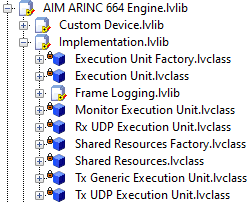

# Theory of Operations

This guide details low-level custom device implementation details of the AIM ARINC 664 custom device and their impact on system performance.

## Communications Bus Template

This custom device is based on the [VeriStand Communications Bus Template](https://github.com/ni/niveristand-communications-bus-template). That project's User Guide contains its own [Theory of Operation section](https://github.com/ni/niveristand-communications-bus-template/blob/main/Docs/User%20Guide.md#theory-of-operation), which details the main components of custom devices implemented based on this pattern. This guide explains the design decisions and performance implications for this custom device.

The most important concept in the Communications Bus Template's design pattern is the ability to execute individual engine components as either inline or asynchronous processes from the same inline custom device. This is detailed in the [Engine section](https://github.com/ni/niveristand-communications-bus-template/blob/main/Docs/User%20Guide.md#engine) of that User Guide.

## Execution Units

This custom device consists of several Execution Units and Factories, and this section details the execution mode and responsibilities of each.

| Execution Unit            | Mode          | Responsibility                                                                                    |
| ------------------------- | ------------- | ------------------------------------------------------------------------------------------------- |
| Monitor Execution Unit    | Async Group 1 | Monitor all incoming 664 frames defined in the Raw Frame Array file and logs them to a pcap file  |
| Rx UDP Execution Unit     | Async Group 1 | Read all incoming 664 frames defined in the Raw Frame Array file                                  |
| Tx Generic Execution Unit | Async Group 1 | Write all outgoing generic 664 frames defined in the Raw Frame Array file                         |
| Tx UDP Execution Unit     | Async Group 1 | Write all outgoing 664 messages to a UDP port                                                     |

### Execution Unit Factory

This Factory is included in the Engine library but executes on the host PC during deployment of the custom device. Each Execution Unit's data is retrieved from the System Definition and channel references are configured. The output of `Create Execution Unit.vi` is deployed to the target and un-flattened in the RT Engine.

## Execution Modes

As shown above, the default configuration of the custom device executes all Execution Units as asynchronous.

The AIM ARINC 664 Custom Device PCL duration increases with the number of ARINC 664 frames or messages configured. Increasing the number of ARINC 664 frames or messages will limit the maximum HP loop rate of the entire VeriStand deployment.

**Note**: The execution time for each Execution Unit and the PCL will vary greatly depending on the system complexity, processor capability, and the number of frames or messages configured.