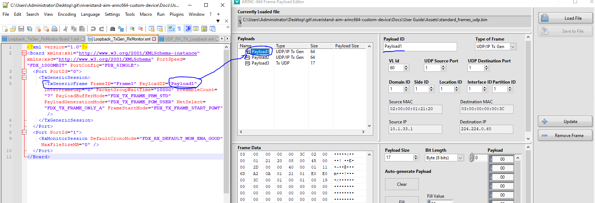

# Using the AIM ARINC 664 Custom Device

This guide demonstrates how to configure and deploy the AIM ARINC 664 custom device. This custom devices uses the AIM BSP (Board Support Package) and Labview API to communicate with the hardware. Refer to the [README.md](../../README.md) to install these component and the associated AIM documentation.

## Configure the AIM ARINC 664 Hardware

The custom device targets one or multiple **Ports** of an [AIM ARINC-664](https://www.ni.com/it-it/shop/model/aim-arinc-664.html) PXIe module. To target multiple modules, you must use multiple instances of the custom device.

## Configure the Custom Device

This guide shows two options for configuring the custom device:
- Configure the Custom Device in System Explorer
- Deploy the System Definition
- Modify the Custom Device Configuration
- Script the Custom Device from LabVIEW


### Configure the Custom Device in System Explorer

1. Create a new VeriStand Project and configure your PXI Linux RT target.
2. Navigate to the `Targets\Controller\Hardware\Custom Devices` entry in the tree.
3. Right-click the **Custom Devices** entry and add a new instance of the **NI\AIM ARINC 664** custom device.
4. Use the Main Page to set the **Initialization Method**, **Board ID**, **Ports Speed**, **Decimation**, and **Async Rx Execution** accordingly.

5. Navigate to the **Configuration File** page.
6. Use the browse buttons to select the example parameters file at `Assets/Loopback_TxGen_RxMonitor.xml` and Raw Frame Array file at `Assets/standard_frames_udp.bin` respectively.


The Parameters file is an XML file which configures capabilities and properties for each port of the board. More information about the Parameters file XML schema can be found in `Docs/Parameters XML File/Parameters XML File.md`.

We will now show 2 different examples that explain how to use the differents *modes of operation* that the AIM board supports. To understand more about the **modes** (e.g. Tx Generic or Monitor) that can be configure on each port, refer to the *Arinc664_Programmers_Guide.pdf* which is installed by the AIM BSP and available at this location: `<Program Files>\AIM GmbH\Arinc 664 Windows BSP <version, e.g. 19.6.0>\Doc`

### Example 1: Using Tx and Rx UDP Comm Port modes

This example uses a simple example Parameters file found at `Assets/UDP_RX_TX_Loopback.xml` and a simple payload file found at `Assets/UDP_RX_TX_Loopback.bin`. This file contains the payload data for the frames that have to be tranmitted.

The file configures two Ports:
- Port1 as Tx UDP with a UDP Port which uses the **commPort - Sampling mode** setup
- Port2 as Rx UDP with a UDP Port which uses the **commPort - Sampling mode** setup


Both ports define the same address *quintuplet* consisting of UDP src/dest ports, IP src/dest addresses and MAC destination address (the VL) to enable a loopback test between the two ports.


Below is the Parameters file. Some Session parameters have been left out for the sake of simplicity. Please read the Theory of Operations found at `Docs/Parameters XML File/Parameters XML File.md` to understand the full list of parameters and features you have access to when creating a Parameters xml file.

```xml
<?xml version="1.0"?>
<Board xmlns:xsi="http://www.w3.org/2001/XMLSchema-instance" xmlns:xsd="http://www.w3.org/2001/XMLSchema">
  <Port PortId="0">
    <TxUdpSession VlId="60" Bag="64" DomainID="1" SideID="1" LocationID="1" InterfaceID="1" MaxFrameLength="1518">
      <TxCommPort PayloadID="Tx1" PartitionID="1" UdpSrcPort="24" UdpDstPort="23" UdpSamplingRate="64" UdpMaxMessageSize="512">
        <Parameter>
          <direction>outgoing</direction>
          <encoding>BNR</encoding>
          <signed>true</signed>
          <startBit>0</startBit>
          <numberOfBits>64</numberOfBits>
          <scale>1</scale>
          <offset>0</offset>
          <name>Param 0</name>
          <unit>V</unit>
          <defaultValue>0</defaultValue>
        </Parameter>
      </TxCommPort>
    </TxUdpSession>
  </Port>
  <Port PortId="1">
    <RxUdpSession VlId="60" VLRange="1" Bag="0" Jitter="0" VLBufSize="32768">
      <RxCommPort PayloadID="Rx1" DomainID="1" SideID="1" LocationID="1" PartitionID="1" UdpSrcPort="24" UdpDstPort="23" UdpMaxMessageSize="512">
        <Parameter>
          <direction>outgoing</direction>
          <encoding>BNR</encoding>
          <signed>true</signed>
          <startBit>0</startBit>
          <numberOfBits>64</numberOfBits>
          <scale>1</scale>
          <offset>0</offset>
          <name>Param 0</name>
          <unit>V</unit>
          <defaultValue>0</defaultValue>
        </Parameter>
      </RxCommPort>
    </RxUdpSession>
  </Port>
</Board>
```

### Example 2: Using Tx Generic and Rx Monitoring modes

This example uses a simple example Parameters file found at `Assets/Loopback_TxGen_RxMonitor.xml` and a simple payload file found at `Assets/standard_frames_udp.bin`. This file contains the payload data for the frames that have to be tranmitted.

The file configures two Ports:
- Port1 as **Tx Generic**
- Port2 as **Rx Monitor**
  - You can configure logging properties to save incoming frames to a [.pcap](https://en.wikipedia.org/wiki/Pcap) file on the target system and analyze it offline


Port1 sends frames to Port2. Port2 records the frames into a pcap file that a packet analyzer software (such as WireShark) can read. To record frames into a .pcap file, Logging must be enabled (see *Logging* page configuration):


Below is the Parameters file for this specific example:

```xml
<?xml version="1.0"?>
<Board xmlns:xsi="http://www.w3.org/2001/XMLSchema-instance" xmlns:xsd="http://www.w3.org/2001/XMLSchema" PortSpeed="FDX_1000MBIT" PortConfig="FDX_SINGLE">
  <Port PortId="0">
    <TxGenericSession>
      <TxGenericFrame FrameID="Frame1" PayloadID="Payload1" InterFrameGap="0" PacketGroupWaitTime="10000" PreambleCount="7" PayloadBufferMode="FDX_TX_FRAME_PBM_STD" PayloadGenerationMode="FDX_TX_FRAME_PGM_USER" NetSelect="FDX_TX_FRAME_ONLY_A" FrameStartMode="FDX_TX_FRAME_START_PGWT" />
    </TxGenericSession>
  </Port>
  <Port PortId="1">
    <RxMonitorSession DefaultCronoMode="FDX_RX_DEFAULT_MON_ENA_GOOD" MaxFileSizeMB="0" />
  </Port>
</Board>
```

For each session in the Parameters configuration file, the Custom Device creates corresponding VeriStand channels under the simulated Ports contained in the file. For this example, Port1 has the Tx Generic session channels, so the Tx Generic Status channels outputs are available to you via a Screen. Port2 has the Monitor session channels, so the Monitor Status channels are available to you. The resulting System Definition tree and screen contents can be seen in later sections of this guide.

### Deploy the System Definition

After configuring the System Definition with the custom device, deploy the System Definition using VeriStand. Once the deployment state reaches **Connected**, use a VeriStand screen to display the custom device inputs and outputs. This example uses VeriStand 2020 R6, so your screen controls may behave differently depending on version.

1. Open a VeriStand Screen
2. Highlight the **System Definition** tree in the left rail
3. Expand the tree to `Targets\Controller\Hardware\Custom Devices\AIM ARINC 664`
4. Drag **Port1** onto the screen
5. Drag **Port2** onto the screen


## Modify the Custom Device Configuration

Once the custom device is configured, you can change the configuration using the `Configuration File` section in System Explorer. If the Parameters file changes on disk, use the **Refresh** button. If you need to select a new file, press the button to load a new path into the dialog. The same is true if you choose to change the Raw Frame Array file.

### Editing XML Parameter File (.xml)

The XML parameter file contains the configuration of each port, including

The parameter file does not include payload data for the frames that are transmitted. They are provided by the payload (.bin) file and linked to the parameter file configuation through **ID**. Each port mode has IDs identified in a specific item:
- Tx Generic mode: ID is specified int 
- Tx UDP mode: ID is specified 

To edit an XML file, click on the **Edit XML File** button in the `Configuration File` section and edit the selected XML file: 


Then edit the file according to the <XML parameter file>

### Editing Payload File (.bin)

The Payload file contains the data that will be transmitted on the frames specified in the XML Parameter file. 

To edit a payload file, click on the **Edit Payload File** button in the `Configuration File` section and use the UI to edit the contents of each frame as specified by its ID:


The Frame editor UI enables the following operations

- Load an existing .bin file
- Save a .bin file
- Modify the payload of a frame in the list : you can change the contents of the payload (e.g. VLID, UDP source/destination ports, data bytes) and click **Add/Update Frame** to apply changes
- Add a new frame payload to the list 
- Remove a frame payload
  
Once you have completed the changes to a payload file and you want to use it with your current system definition, click on **Select Current File**. To close the window withoug applying changes to the system definition, click **Cancel**



## Script the Custom Device from LabVIEW

The AIM ARINC 664 custom device includes a LabVIEW scripting API to configure the custom device programmatically. This allows users to parse an existing AIM ARINC 664 database into a working custom device configuration without the need to create a Parameters file. It also allows importing a Parameters file programmatically instead of through System Explorer.

To use the scripting API, the optional scripting package must be installed:
`ni-aim-arinc-664-veristand-20xx-labview-support`

In addition to this package you must install the [AIM ARINC 664 BSP Driver and LabVIEW API](https://www.ni.com/en/support/downloads/software-products/download.aim-arinc-664-driver.html#494504) 2023Q4 or later and once the AIM BSP is installed, run the `aim_gmbh_lib_arinc_664-<a.b.c.d>.vip` VI Package which containes the LabVIEW VIs. Version 1.0.0.18 or later of the .vip is required.

The scripting API includes two example files inside a LabVIEW example project found at the following directory: `C:\Program Files (x86)\National Instruments\LabVIEW 20xx\examples\NI VeriStand Custom Devices\AIM ARINC 664`. It contains two example VIs:

- `Import Parameters Configuration to New AIM ARINC 664 Custom Device.vi` - Demonstrates using the AIM ARINC 664 scripting API to configure the custom device by importing a parameters configuration file.
- `Build New AIM ARINC 664 Custom Device.vi` - Demonstrates using the AIM ARINC 664 scripting API to configure the custom device by building from configuration clusters.


