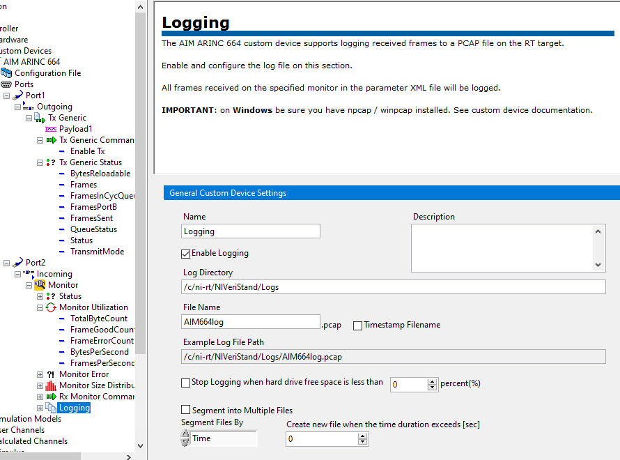

# Using the AIM ARINC 664 Custom Device

This guide demonstrates how to configure and deploy the AIM ARINC 664 custom device.

## Configure the AIM ARINC 664 Hardware

The custom device targets one or multiple **Ports** of an AIM ARINC 664 PXIe module. To target multiple modules, you must use multiple instances of the custom device.

## Configure the Custom Device

This guide shows two options for configuring the custom device:
- Importing a Parameters file in System Explorer
- Scripting the custom device configuration

### Importing a Parameters file in System Explorer
The Parameters file is generated from an XML schema for configuring the custom device. More information about the Parameters file XML schema can be found in `Docs/Parameters XML File/Parameters XML File.md`.

This example uses a simple example Parameters file found at `Assets/Loopback_TxGen_RxMonitor.xml` and a simple Raw Frame Array file found at `Assets/standard_frames_udp.bin`.

The file configures two Ports:
- Port1 as Tx Generic
    - The Raw Frame Array file configures the frames to be sent by Port1
- Port2 as Monitor


Port1 sends frames to Port2. Port2 records the frames into a pcap file that a packet analyzer software (such as WireShark) can read. To record frames into a .pcap file, Logging must be enabled (see *Logging* page configuration):



Below is the Parameters file. Some Session parameters have been left out for the sake of simplicity. Please read the Theory of Operations found at `Docs/Theory of Operations/Theory of Operations.md` to understand the full list of parameters and features you have access to when creating a Parameters xml file.

```xml
<?xml version="1.0"?>
<Board xmlns:xsi="http://www.w3.org/2001/XMLSchema-instance" xmlns:xsd="http://www.w3.org/2001/XMLSchema" PortSpeed="FDX_1000MBIT">
  <Port PortId="0" PortMap="1">
    <TxGenericSession TxStartModeType="FDX_START" />
  </Port>
  <Port PortId="1" PortMap="2">
    <RxMonitorSession DefaultCronoMode="FDX_RX_DEFAULT_MON_ENA_GOOD" MaxFileSizeMB="0" />
  </Port>
</Board>
```

For each session in the Parameters configuration file, the Custom Device creates corresponding VeriStand channels under the simulated Ports contained in the file. For this example, Port1 has the Tx Generic session channels, so the Tx Generic Status channels outputs are available to you via a Screen. Port2 has the Monitor session channels, so the Monitor Status channels are available to you. The resulting System Definition tree and screen contents can be seen in later sections of this guide.

### Configure the Custom Device in System Explorer

1. Create a new VeriStand Project and configure your PXI Linux RT target.
2. Navigate to the `Targets\Controller\Hardware\Custom Devices` entry in the tree.
3. Right-click the **Custom Devices** entry and add a new instance of the **NI\AIM ARINC 664** custom device.
4. Use the Main Page to set the **Initialization Method**, **Board ID**, **Ports Speed**, **Decimation**, and **Async Rx Execution** accordingly.

5. Navigate to the **Configuration File** page.
6. Use the browse buttons to select the example parameters file at `Assets/Loopback_TxGen_RxMonitor.xml` and Raw Frame Array file at `Assets/standard_frames_udp.bin` respectively.


### Scripting the Custom Device Configuration

The AIM ARINC 664 custom device includes a LabVIEW scripting API to configure the custom device programmatically. This allows users to parse an existing AIM ARINC 664 database into a working custom device configuration without the need to create a Parameters file. It also allows importing a Parameters file programmatically instead of through System Explorer.

To use the scripting API, the optional scripting package must be installed:
`ni-aim-arinc-664-veristand-20xx-labview-support`

The scripting API includes two example files inside a LabVIEW example project found at the following directory: `C:\Program Files (x86)\National Instruments\LabVIEW 20xx\examples\NI VeriStand Custom Devices\AIM ARINC 664`. It contains two example VIs:

- `Import Parameters Configuration to New AIM ARINC 664 Custom Device.vi` - Demonstrates using the AIM ARINC 664 scripting API to configure the custom device by importing a parameters configuration file.
- `Build New AIM ARINC 664 Custom Device.vi` - Demonstrates using the AIM ARINC 664 scripting API to configure the custom device by building from configuration clusters.


## Deploy the System Definition

After configuring the System Definition with the custom device, deploy the System Definition using VeriStand. Once the deployment state reaches **Connected**, use a VeriStand screen to display the custom device inputs and outputs. This example uses VeriStand 2020 R6, so your screen controls may behave differently depending on version.

1. Open a VeriStand Screen
2. Highlight the **System Definition** tree in the left rail
3. Expand the tree to `Targets\Controller\Hardware\Custom Devices\AIM ARINC 664`
4. Drag **Port1** onto the screen
5. Drag **Port2** onto the screen


## Modifying the Custom Device Configuration

Once the custom device is configured, you can change the configuration using the **Configuration File** page in System Explorer. If the Parameters file changes on disk, use the **Refresh** button. If you need to select a new file, press the button to load a new path into the dialog. The same is true if you choose to change the Raw Frame Array file.